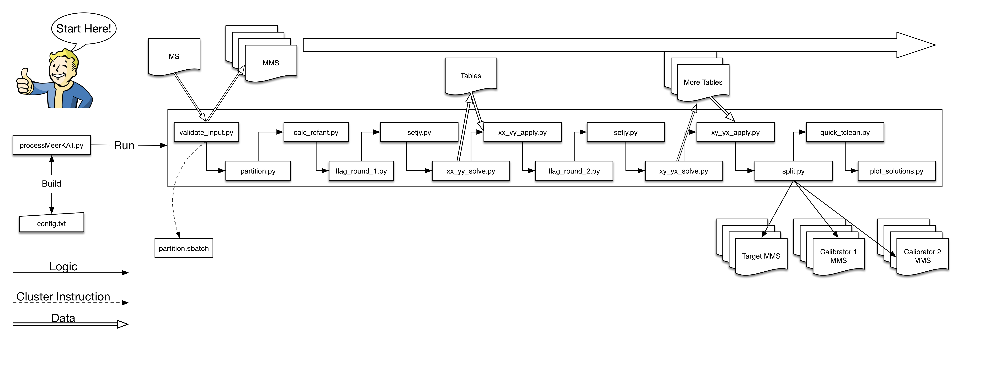

# MeerKATinIRIS
This documentantion helps you to run MeerKAT both locally and on IRIS machines.

If you want to know more about MeerKAT pipeline itself, please look at https://idia-pipelines.github.io/docs/processMeerKAT/calibration-in-processmeerkat/

Git clone the repository using the below command
```
git clone https://github.com/priyaa-t/MeerKATinIRIS.git
```
Let's see the contents in the MeerKATinIRIS repo.
```
MeerKATinIRIS/
└─── README.md
│
│
└─── processMeerKAT/
        │       config_parser.py 
        │       job-meerkat.py
        │       myconfig.txt
        │       processMeerKAT.py
        │       run-meerkat.sh
        │       
        │
        └───data/
        │   └───data.ms
        │
        └-──cal_scripts/
                __init__.py
                bookkeeping.py
                calc_refant.py
                flag_round_1.py
                flag_round_2.py
                get_fields.py
                partition.py
                plot_solutions.py
                quick_tclean.py
                setjy.py
                split.py
                validate_input.py
                xx_yy_apply.py
                xx_yy_solve.py
                xy_yx_apply.py
                xy_yx_solve.py
```

## Get sample data and singularity containers from LFN:
To run locally, you need data and singularity containers from LFN. This step is not needed if you running direcly on LFN.

###### To get **data** - Data folder
'data' folder contains the sample data which helps you to understand how MeerKAT pipeline works. You should replace it with your .ms data on which you want to run the pipeline on. Sample data '1491550051.ms' can be fetched from DiRAC LFN (LFN:/skatelescope.eu/user/p/priyaa.thavasimani/MeerKAT/1491550051.tar.gz).

```
dirac-dms-get-file LFN:/skatelescope.eu/user/p/priyaa.thavasimani/MeerKAT/1491550051.tar.gz
tar -xzvf 1491550051.tar.gz <extract to your data folder>
```
###### To get casameer singularity container:
```
dirac-dms-get-file LFN:/skatelescope.eu/user/p/priyaa.thavasimani/MeerKAT/casameer-5.4.1.xvfb.simg
mv casameer-5.4.1.xvfb.simg <move the container to processMeerKAT folder>
```

## *myconfig.txt* - Configuration file
Each script will take a common configuration file called "myconfig.txt" in this example, which contains 
crosscal values including number of base lines, referance antenna, bad antennas and bad freqeuncy ranges. Based on the input .MS data, this can be automatically generated using the following command. Sample configuration file (myconfig.txt) for sample data is already given, so you can skip this step.

The below shows how to create myconfig.txt based on the specified data and container.

```
priyaat@lofar7 /raid/scratch/priyaa/MeerKATinIRIS > python2 processMeerKAT/processMeerKAT.py -B -C myconfig.txt -l -M processMeerKAT/data/1491550051.ms/ -c /raid/scratch/priyaa/casameer-5.4.1.xvfb.simg
2020-06-22 19:39:21,284 INFO: Extracting field IDs from measurement set "processMeerKAT/data/1491550051.ms/" using CASA.
=========================================
The start-up time of CASA may vary
depending on whether the shared 2020-06-22 19:59:16,252 INFO: Extracting field IDs from measurement set "processMeerKAT/data/1491550051.ms/" using CASA.
=========================================
The start-up time of CASA may vary
depending on whether the shared libraries
are cached or not.
=========================================
IPython 5.1.0 -- An enhanced Interactive Python.
CASA 5.4.1-31   -- Common Astronomy Software Applications
--> CrashReporter initialized.
2020-06-22 19:59:21,028 WARNING: The number of threads (8 node(s) x 4 task(s) = 32) is not ideal compared to the number of scans (12) for "processMeerKAT/data/1491550051.ms/".
2020-06-22 19:59:21,028 WARNING: Config file has been updated to use 2 node(s) and 4 task(s) per node.
2020-06-22 19:59:21,028 INFO: For the best results, update your config file so that nodes x tasks per node = 7.
2020-06-22 19:59:21,038 INFO: Multiple fields found with intent "CALIBRATE_FLUX" in dataset "processMeerKAT/data/1491550051.ms/" - [0 1].
2020-06-22 19:59:21,039 WARNING: Only using field "0" for "fluxfield", which has the most scans (1).
2020-06-22 19:59:21,039 WARNING: Putting extra fields with intent "CALIBRATE_FLUX" in "targetfields" - [1]
2020-06-22 19:59:21,039 INFO: Multiple fields found with intent "CALIBRATE_BANDPASS" in dataset "processMeerKAT/data/1491550051.ms/" - [0 1].
2020-06-22 19:59:21,039 WARNING: Only using field "0" for "bpassfield", which has the most scans (1).
2020-06-22 19:59:21,040 INFO: Multiple fields found with intent "CALIBRATE_PHASE" in dataset "processMeerKAT/data/1491550051.ms/" - [1 2].
2020-06-22 19:59:21,040 WARNING: Only using field "2" for "phasecalfield", which has the most scans (5).
2020-06-22 19:59:21,041 INFO: [fields] section written to "processMeerKAT/myconfig.txt". Edit this section to change field IDs (comma-seperated string for multiple IDs).
2020-06-22 19:59:21,329 INFO: Config "processMeerKAT/myconfig.txt" generated.libraries
are cached or not.
=========================================

IPython 5.1.0 -- An enhanced Interactive Python.

CASA 5.4.1-31   -- Common Astronomy Software Applications

--> CrashReporter initialized.
2020-06-22 19:39:26,290 INFO: Config "myconfig.txt" generated.
```
move the generated myconfig.txt to processMeerKAT folder.

## *config_parser.py* 
'config_parser.py' is the helper script to validate and parse the arguments as well to parse and overwrite the configuration.

## **cal_scripts** - Main scripts to run MeerKAT
'cal_scripts' folder will have all the scripts to run the whole MeerKAT pipeline.  The 'bookkeeping.py' and 'get_fields.py' are helper scripts which will not be part of MeerKAT pipeline.

## **run-meerkat.sh** - Bash script for singularity call **cal_script** scripts.
'run-meerkat.sh' is the bash script that runs the meerkat pipeline and the sequence to run the MeerKAT follows the workflow order visulaized in the figure .

###### To run locally with the data '1491550051ms', you can simply run the following command.

```
bash run-meerkat.sh
```
###### Sample Outputs Generated 
After successfully running the pipeline, you should get .tt0, psf, residual and model images as below.

```
priyaat@lofar7 /raid/scratch/priyaa/MeerKAT-IRIS/processMeerKAT > cd images
priyaat@lofar7 /raid/scratch/priyaa/MeerKAT-IRIS/processMeerKAT/images > ls
1491550051_0252-712.im.alpha         1491550051_0252-712.im.residual.tt0   1491550051_0408-65.im.model.tt0      1491550051_1934-638.im.alpha.error   1491550051_1934-638.im.residual.tt1    1491550051_DEEP_2_off.im.model.tt1
1491550051_0252-712.im.alpha.error   1491550051_0252-712.im.residual.tt1   1491550051_0408-65.im.model.tt1      1491550051_1934-638.im.fits          1491550051_1934-638.im.sumwt.tt0       1491550051_DEEP_2_off.im.pb.tt0
1491550051_0252-712.im.fits          1491550051_0252-712.im.sumwt.tt0      1491550051_0408-65.im.pb.tt0         1491550051_1934-638.im.gridwt_moswt  1491550051_1934-638.im.sumwt.tt1       1491550051_DEEP_2_off.im.psf.tt0
1491550051_0252-712.im.gridwt_moswt  1491550051_0252-712.im.sumwt.tt1      1491550051_0408-65.im.psf.tt0        1491550051_1934-638.im.image.tt0     1491550051_1934-638.im.sumwt.tt2       1491550051_DEEP_2_off.im.psf.tt1
1491550051_0252-712.im.image.tt0     1491550051_0252-712.im.sumwt.tt2      1491550051_0408-65.im.psf.tt1        1491550051_1934-638.im.image.tt1     1491550051_1934-638.im.workdirectory   1491550051_DEEP_2_off.im.psf.tt2
1491550051_0252-712.im.image.tt1     1491550051_0252-712.im.workdirectory  1491550051_0408-65.im.psf.tt2        1491550051_1934-638.im.mask          1491550051_DEEP_2_off.im.alpha         1491550051_DEEP_2_off.im.residual.tt0
1491550051_0252-712.im.mask          1491550051_0408-65.im.alpha           1491550051_0408-65.im.residual.tt0   1491550051_1934-638.im.model.tt0     1491550051_DEEP_2_off.im.alpha.error   1491550051_DEEP_2_off.im.residual.tt1
1491550051_0252-712.im.model.tt0     1491550051_0408-65.im.alpha.error     1491550051_0408-65.im.residual.tt1   1491550051_1934-638.im.model.tt1     1491550051_DEEP_2_off.im.fits          1491550051_DEEP_2_off.im.sumwt.tt0
1491550051_0252-712.im.model.tt1     1491550051_0408-65.im.fits            1491550051_0408-65.im.sumwt.tt0      1491550051_1934-638.im.pb.tt0        1491550051_DEEP_2_off.im.gridwt_moswt  1491550051_DEEP_2_off.im.sumwt.tt1
1491550051_0252-712.im.pb.tt0        1491550051_0408-65.im.gridwt_moswt    1491550051_0408-65.im.sumwt.tt1      1491550051_1934-638.im.psf.tt0       1491550051_DEEP_2_off.im.image.tt0     1491550051_DEEP_2_off.im.sumwt.tt2
1491550051_0252-712.im.psf.tt0       1491550051_0408-65.im.image.tt0       1491550051_0408-65.im.sumwt.tt2      1491550051_1934-638.im.psf.tt1       1491550051_DEEP_2_off.im.image.tt1     1491550051_DEEP_2_off.im.workdirectory
1491550051_0252-712.im.psf.tt1       1491550051_0408-65.im.image.tt1       1491550051_0408-65.im.workdirectory  1491550051_1934-638.im.psf.tt2       1491550051_DEEP_2_off.im.mask
1491550051_0252-712.im.psf.tt2       1491550051_0408-65.im.mask            1491550051_1934-638.im.alpha         1491550051_1934-638.im.residual.tt0  1491550051_DEEP_2_off.im.model.tt0
```

And plots are generated under plots directory and it should have following contents:
```
priyaat@lofar7 /raid/scratch/priyaa/MeerKAT-IRIS/processMeerKAT/plots > ls
0252-712_freq_amp.png   0408-65_freq_amp.png   1934-638_freq_amp.png   bpass_freq_amp.png    bpass_real_imag.png      DEEP_2_off_real_imag.png  phasecal_time_amp.png
0252-712_real_imag.png  0408-65_real_imag.png  1934-638_real_imag.png  bpass_freq_phase.png  DEEP_2_off_freq_amp.png  phasecal_real_imag.png    phasecal_time_phase.png
```
###### How long does the MeerKAT pipeline run for sample data i.e. '1491550051.ms'?
It will take 2 and 1/2 hours to run the whole pipeline for the sample data i.e: '1491550051.ms' both locally and on IRIS.

###### To run on IRIS:

To submit the 'run-meerkat.sh' job to IRIS, 'job-meerkat.py' is used and this can be run by using following command. If there is any permission denied errors shown, use ```chmod u+x job-meerkat.py``` to give permission.

```
./job-meerkat.py
```

All the images and plots will be stored as images_$1.tar.gz and plots_$1.tar.gz in LFN as specified in the Output Sandbox, where '$1' refers to the job id.
